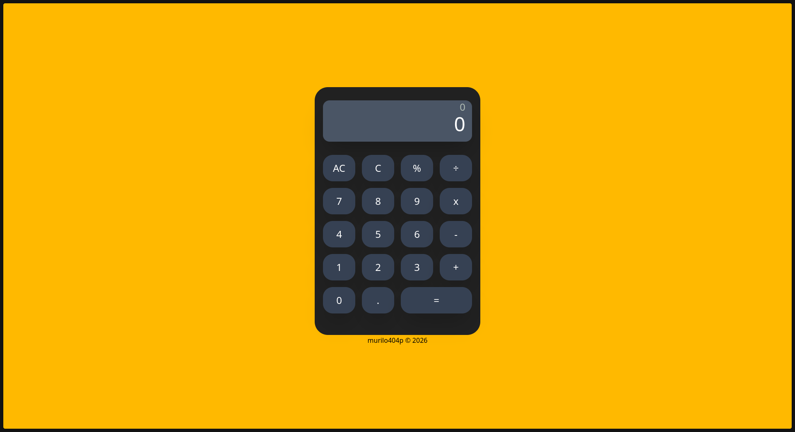

<h1 align='center'>🧮 CALCULATOR</h1>

  <a href='#-sobre-o-projeto'>Sobre</a>
  &nbsp;&nbsp;|&nbsp;&nbsp;
  <a href='#-desenvolvimento'>Desenvolvimento</a>
  &nbsp;&nbsp;|&nbsp;&nbsp;
  <a href='#-funcionalidades'>Funcionalidades</a>
  &nbsp;&nbsp;|&nbsp;&nbsp;
  <a href='#-tecnologias'>Tecnologias</a>

  

## 💁‍♂️ Sobre o Projeto

Este projeto consiste em uma calculadora funcional desenvolvida como parte do currículo do **The Odin Project**.

A aplicação permite realizar operações matemáticas básicas por meio de uma interface intuitiva e responsiva, simulando o comportamento de uma calculadora real.

Durante o desenvolvimento, foram aplicados conceitos fundamentais de JavaScript, como manipulação do DOM, eventos, gerenciamento de estado e validação de entradas do usuário.

---

## 📅 Desenvolvimento

Este projeto foi desenvolvido durante meus estudos de JavaScript no **The Odin Project**, com o objetivo de praticar lógica de programação e manipulação de interfaces web.

Além das operações matemáticas, a aplicação possui validações para evitar entradas inválidas, tratamento de erros e atualização dinâmica do display.

---

## ✨ Funcionalidades

- ➕ Adição
- ➖ Subtração
- ✖️ Multiplicação
- ➗ Divisão
- 🔢 Suporte a números decimais
- 🧹 Limpar último caractere
- 🗑️ Limpar toda a expressão
- ⚠️ Tratamento de expressões inválidas
- 📱 Interface responsiva
- 🎨 Estilização moderna utilizando Tailwind CSS

---

## 🤖 Tecnologias

Este projeto foi desenvolvido utilizando as seguintes tecnologias:

<ul>
    <li>HTML5</li>
    <li>CSS3</li>
    <li>JavaScript</li>
    <li>Tailwind CSS</li>
    <li>Vite</li>
    <li>Math.js</li>
    <li>Git</li>
    <li>GitHub</li>
</ul>

---

## 🚀 Acesse o Projeto

🔗 **Deploy:** https://murilo404p.github.io/Calculator-TOP/

---

Desenvolvido por <strong>Murilo Silva Papacidero</strong> 👤

